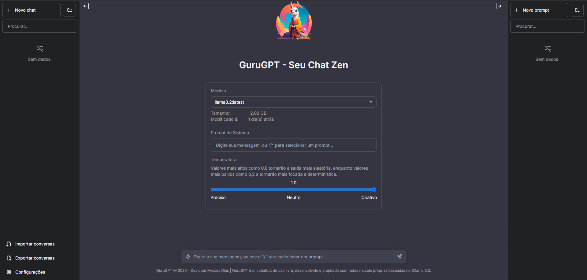

# GuruGPT - Seu Chat Zen

## Sobre
GuruGPT é uma interface de usuário de chat de código aberto para suportar a rede neural desenvolvido por Marcos Dias baseado em Ollama.



## Atualizações
Chatbot GuruGPT será atualizado ao longo do tempo.

### Próximos passos
- [ ] baixar um modelo
- [ ] excluir um modelo
- [ ] mostrar informações do modelo

## Docker
Construir localmente:
```shell
docker build -t gurugpt .
docker run -p 3000:3000 gurugpt
```

Pull do ghcr:

```bash
docker run -p 3000:3000 gurugpt:main
```

## Rodando localmente

### 1. Clone Repo

```bash
git clone https://github.com/ProfMPPDias/gurugpt.git
```

### 2. Mova a pasta

```bash
cd gurugpt
```

### 3. Instalar Dependencias

```bash
npm ci
```

### 4. Rodar a rede neural Ollama Server

Por via cli:

```bash
ollama serve
```

ou via [desktop client](https://ollama.ai/download)

### 5. Rode o App

```bash
npm run dev
```

### 6. Use isso

Você deve ser capaz de começar a conversar.

## Configuração

Ao implantar o aplicativo, as seguintes variáveis de ambiente podem ser definidas:

| Variável de Ambiente              | Valor padrão                   | Descrição                                                                                                                                 |
| --------------------------------- | ------------------------------ | ----------------------------------------------------------------------------------------------------------------------------------------- |
| DEFAULT_MODEL                     | `mistral:latest`               | O modelo padrão a ser usado em novas conversas                                                                                            |
| NEXT_PUBLIC_DEFAULT_SYSTEM_PROMPT | [ver aqui](utils/app/const.ts) | O prompt de sistema padrão a ser usado em novas conversas                                                                                 |
| NEXT_PUBLIC_DEFAULT_TEMPERATURE   | 1                              | A temperatura padrão a ser usada em novas conversas                                                                                       |

## Contato

Se você tiver alguma dúvida, sinta-se à vontade para entrar em contato comigo no email mppdias@outlook.com.
